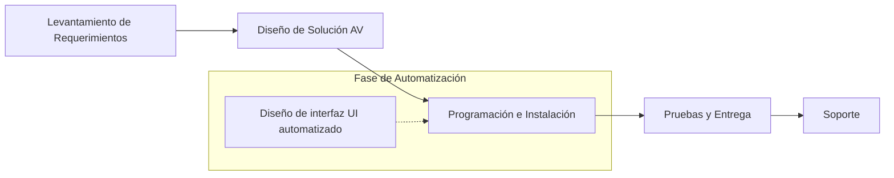
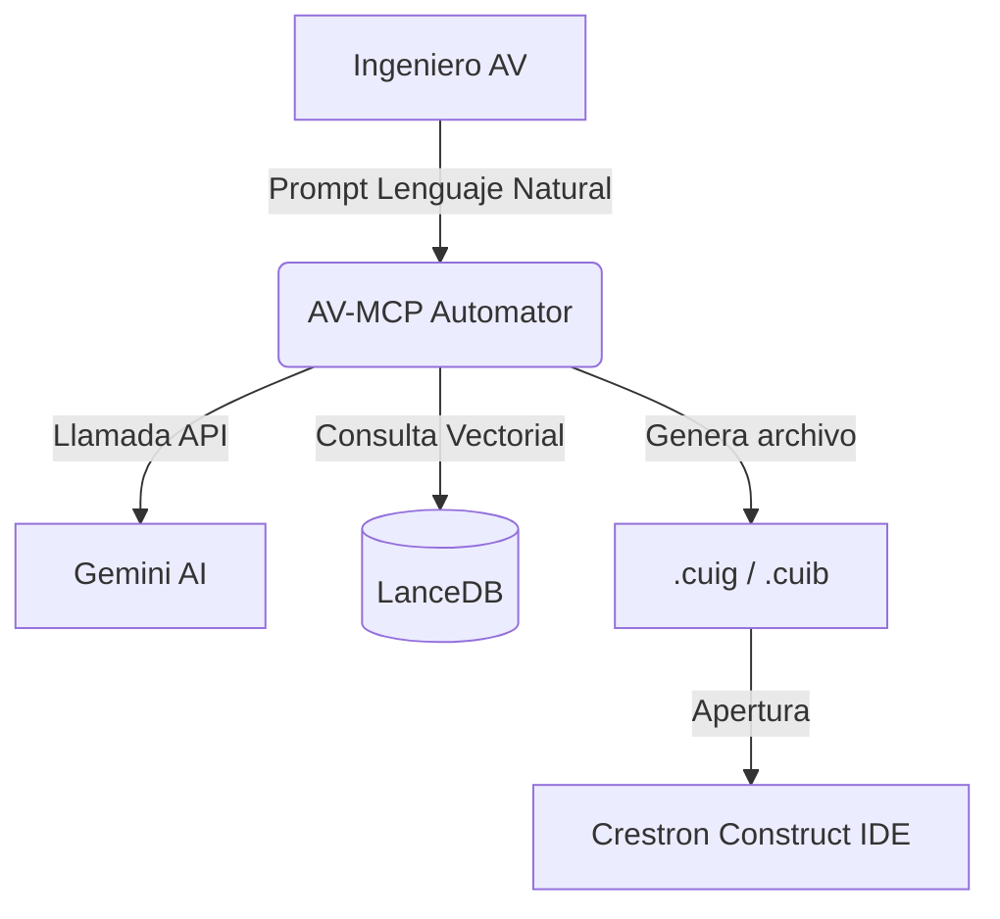
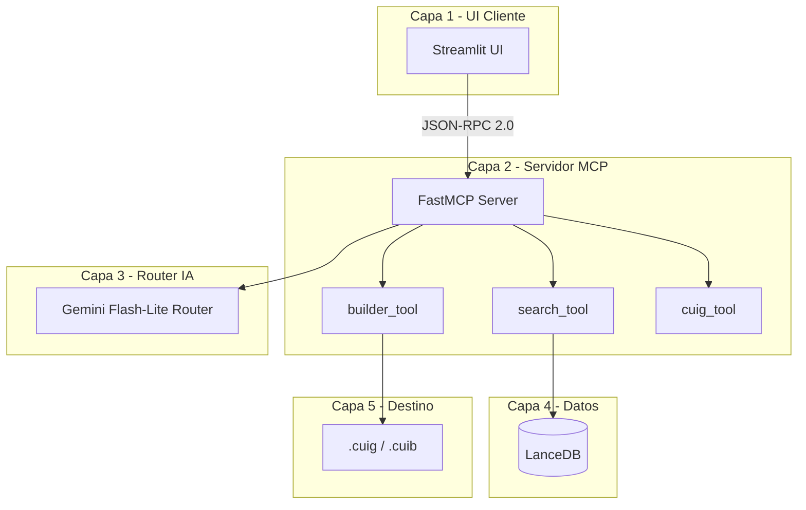
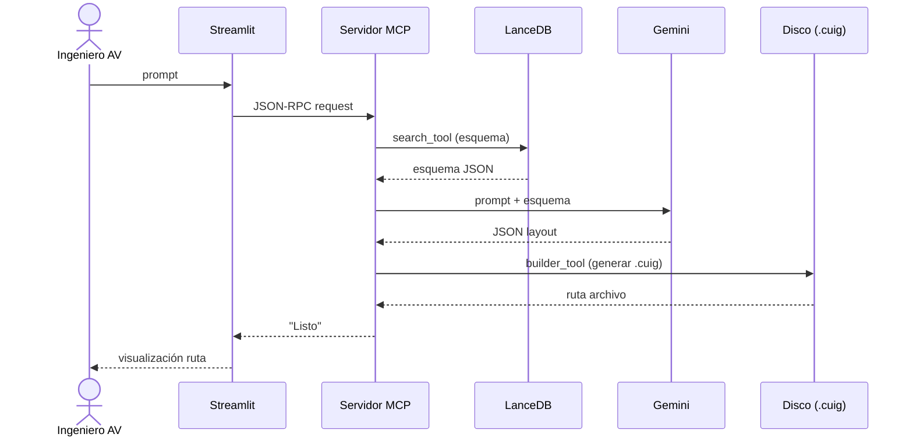
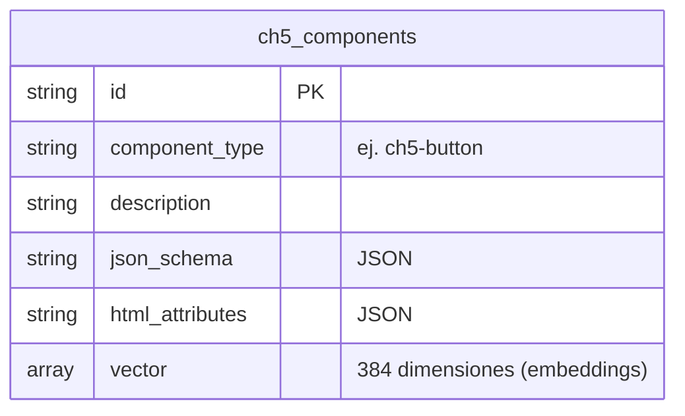
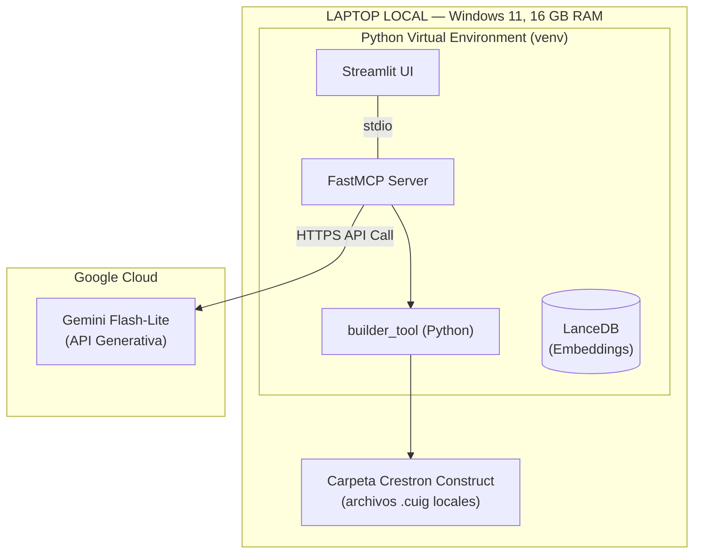
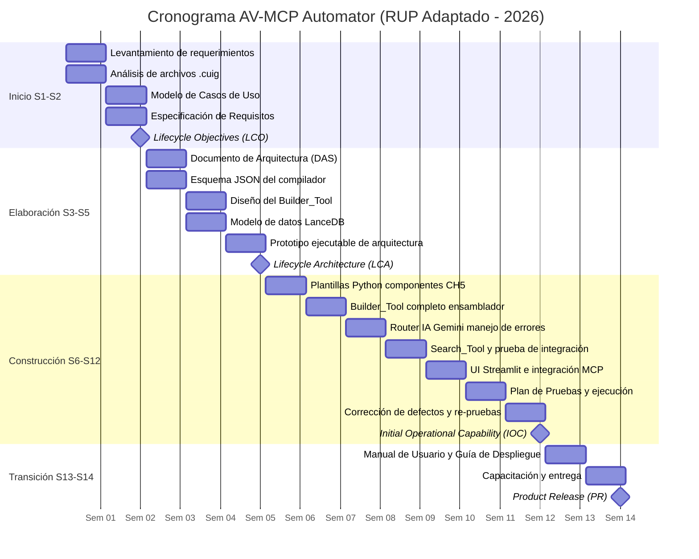

# 4. Desarrollo

## 4.1 Metodología o Marco de Referencia
Se aplicó el Proceso Unificado Racional (RUP) en su estructura de 4 fases (Inicio, Elaboración, Construcción y Transición), adaptado a un equipo de un solo desarrollador que asumió todos los roles:

| Fase | Semanas | Meta Principal |
|---|---|---|
| Inicio | S1-S2 | Definir el problema, casos de uso y riesgos |
| Elaboración | S3-S5 | Arquitectura "Compilador MCP", esquema JSON y base LanceDB |
| Construcción | S6-S12 | Builder_Tool, Router IA, UI Streamlit y pruebas automatizadas |
| Transición | S13-S14 | Documentación operativa, manuales y entrega |

| Fase RUP | Artefacto Formal RUP | Entregable Concreto en Proyecto (Evidencia Real) | Estado / Nota |
| --- | --- | --- | --- |
| Inicio | Documento Visión | Definición de Requerimientos y Cumplimiento de Objetivos (Sec. 4.2.1, 4.2.2 y 4.10) | Simplificado |
| Inicio | Glosario | Terminología implícita en Requerimientos y Casos de Uso (Sec. 4.2.1, 4.2.3) | Informal |
| Inicio | Modelo de Casos de Uso | Diagrama y descripción de Casos de Uso (Sec. 4.2.3) | Completado |
| Inicio | Especificación Suplementaria de Requisitos | Requerimientos No Funcionales (Sec. 4.2.2) | Simplificado |
| Inicio | Lista de Riesgos | Decisiones arquitectónicas y mitigación (Sec. 4.4.3, 4.9.3) | Mapeado implícitamente en [Sec. 4.4.3 y 4.9.3] |
| Elaboración | Documento de Arquitectura de Software (DAS) | Arquitectura de Negocio, Aplicaciones, Datos y Tecnológica (Sec. 4.3 a 4.6) | Completado |
| Elaboración | Prototipo de Arquitectura Ejecutable | Modelo de datos LanceDB y Esquema JSON del Compilador (Sec. 4.5.1, 4.5.2) | Completado |
| Elaboración | Modelo de Diseño | Diagramas de Contexto, Componentes y Flujo (Sec. 4.4) | Completado |
| Construcción | Casos de Prueba | Ejecución de CP-01 a CP-14 y cobertura (Sec. 4.9.4) | Completado |
| Transición | Manual de Usuario | Capturas de Prototipo e Interfaz visual de la herramienta (Sec. 4.7) | Simplificado |
| Transición | Guía de Despliegue | Empaquetado y variables operativas en Implementación (Sec. 4.9.5) | Mapeado implícitamente en [Sec. 4.9.5] |
| **Hito RUP** | **Lifecycle Objectives (LCO)** | Hito: Fin de la Fase de Inicio | Semana 2 |
| **Hito RUP** | **Lifecycle Architecture (LCA)** | Hito: Fin de la Fase de Elaboración | Semana 5 |
| **Hito RUP** | **Initial Operational Capability (IOC)** | Hito: Fin de la Fase de Construcción | Semana 12 |
| **Hito RUP** | **Product Release (PR)** | Hito: Fin de la Fase de Transición | Semana 14 |

Las iteraciones dentro de cada fase se acotaron para mantener el foco en el entregable principal: el compilador MCP que genera archivos `.cuig` válidos para Crestron Construct.
Esta implementación responde directamente al objetivo de organizar eficientemente el desarrollo para reducir el tiempo total del proyecto cumpliendo con los estándares académicos y profesionales.

La adopción de esta metodología corresponde a una **adaptación ágil de RUP para un único desarrollador (RUP-adaptado)**. La literatura académica respalda la simplificación del grado de formalidad de los artefactos y la consolidación de roles en equipos pequeños, con el propósito de reducir la sobrecarga de documentación sin perder los principios fundamentales de un desarrollo guiado por casos de uso, centrado en la arquitectura y gestionado mediante iteraciones enfocadas en mitigar riesgos tempranamente.

## 4.2 Requerimientos
### 4.2.1 Requerimientos Funcionales
| ID | Requisito | Prioridad |
|---|---|---|
| RF-01 | Generar archivos .cuig válidos a partir de un prompt en lenguaje natural | Alta |
| RF-02 | Recuperar el esquema JSON del componente CH5 solicitado desde LanceDB | Alta |
| RF-03 | Validar el JSON generado por la IA mediante un esquema Pydantic antes del ensamblaje | Alta |
| RF-04 | Reintentar la generación con instrucción correctiva ante respuesta JSON mal formada | Media |
| RF-05 | Restringir componentes según el tipo de panel de destino seleccionado | Media |
| RF-06 | Permitir la selección de temas visuales Pro AV para la generación de color de fondo | Baja |
Esta definición de requerimientos responde al objetivo de alinear el sistema con las necesidades técnicas exactas de los ingenieros AV para su uso en producción.

### 4.2.2 Requerimientos No Funcionales
| ID | Requisito | Valor objetivo |
|---|---|---|
| RNF-01 | Tiempo de respuesta (prompt → archivo generado) | < 10 segundos |
| RNF-02 | Presupuesto de licencias del stack | S/. 0 |
| RNF-03 | Consumo de RAM en modo operación (Gemini como principal) | < 4 GB |
| RNF-04 | Tasa de apertura sin errores de .cuig en Crestron Construct | 100% |
Estos requerimientos no funcionales garantizan que el sistema cumpla con el objetivo de mantener un costo de licencias de S/. 0 y operar bajo las restricciones de hardware del equipo del desarrollador.

### 4.2.3 Casos de Uso
Los casos de uso del sistema desde la perspectiva del ingeniero AV son los siguientes:

```mermaid
usecaseDiagram
    actor "Ingeniero AV" as AV
    usecase "Generar página" as CU01
    usecase "Actualizar proyecto" as CU02
    usecase "Consultar plantilla" as CU03
    usecase "Validar archivo" as CU04
    usecase "Conmutar IA" as CU05
    
    AV --> CU01
    AV --> CU02
    AV --> CU03
    AV --> CU04
    CU01 .> CU05 : <<include>>
```
La implementación de estos flujos de uso responde directamente al objetivo de facilitar el trabajo repetitivo de maquetación visual mediante interacciones claras, reduciendo así la carga operativa.

## 4.3 Arquitectura de Negocio
### 4.3.1 Mapa de Macroprocesos
El macroproceso de DACER S.A.C. como empresa de integración Pro AV incluye: Levantamiento de requerimientos del cliente, Diseño de solución AV, Programación e instalación, Pruebas y entrega, y Soporte. El proceso automatizado de "Diseño de interfaz UI" se sitúa en la fase de Programación e instalación.


La integración en este nivel cumple con el objetivo de encajar la herramienta dentro del flujo real de trabajo de la empresa sin modificar otros procesos consolidados.

### 4.3.2 Diagrama de Procesos del Negocio (AS-IS vs TO-BE)
El proceso anterior implicaba que el ingeniero maquetaba manualmente arrastrando elementos, con alto consumo de tiempo. El proceso actual permite que el ingeniero describa la interfaz en lenguaje natural, el sistema genere los archivos, y el ingeniero ajuste visualmente los detalles.

```mermaid
flowchart TD
    subgraph AS-IS (Proceso Anterior)
    A1[Requerimiento de Sala] --> B1[Abrir Crestron Construct]
    B1 --> C1[Arrastrar componentes manualmente]
    C1 --> D1[Configurar IDs y propiedades]
    D1 --> E1[Validación visual]
    end

    subgraph TO-BE (Proceso Actual)
    A2[Requerimiento de Sala] --> B2[Ingresar prompt en UI Streamlit]
    B2 --> C2[Generación automática de .cuig (AV-MCP)]
    C2 --> D2[Abrir .cuig en Crestron Construct]
    D2 --> E2[Ajustes visuales rápidos]
    end
```
Esta mejora operativa responde directamente al objetivo principal de reducir el tiempo de maquetación inicial en un 40-60%.

## 4.4 Arquitectura de Aplicaciones
### 4.4.1 Diagrama de Contexto del Sistema
El sistema AV-MCP Automator actúa como puente entre el ingeniero, la IA y el entorno nativo de desarrollo.


Esta arquitectura responde al objetivo de proveer una integración fluida con herramientas de software preexistentes sin costos adicionales de infraestructura.

### 4.4.2 Diagrama de Componentes del Sistema
El sistema consta de 5 capas: Streamlit, Servidor FastMCP, Router IA, LanceDB, y la salida .cuig.


La separación en capas asegura escalabilidad y responde al objetivo de aislar la complejidad técnica de la IA respecto al ensamblaje del archivo de salida.

### 4.4.3 Diagrama de Flujo del Sistema
El flujo end-to-end (CU-01) muestra el recorrido del dato desde el input hasta el sistema de archivos:


Este flujo fuertemente determinista responde al objetivo de generar archivos nativos de software 100% compatibles, mitigando el riesgo de que la IA genere sintaxis de componentes malformada.

## 4.5 Arquitectura de Datos
### 4.5.1 Modelo de Datos Vectorial (LanceDB)
El proyecto utiliza LanceDB, una base vectorial embebida. La tabla `ch5_components` almacena los componentes con campos: `id`, `component_type`, `description`, `json_schema`, `html_attributes`, y `vector` (384 dimensiones). Se eligió vectorial sobre relacional por la necesidad de búsqueda por similitud semántica.



| Campo | Tipo | Descripción |
|---|---|---|
| `id` | `string` | Identificador único del componente (PK) |
| `component_type` | `string` | Tipo CH5 (ej. `ch5-button`, `ch5-slider`) |
| `description` | `string` | Descripción semántica del componente |
| `json_schema` | `string (JSON)` | Esquema JSON de atributos válidos |
| `html_attributes` | `string (JSON)` | Atributos HTML nativos del componente |
| `vector` | `array[384]` | Embedding vectorial (all-MiniLM-L6-v2) |
Esta elección técnica responde al objetivo de proporcionar al LLM contexto preciso y relevante sobre componentes en milisegundos y consumiendo menos de 1GB de RAM.

### 4.5.2 Esquema de Datos del Compilador (JSON Schema)
El contrato JSON entre Gemini y el Builder_Tool es el verdadero "modelo de datos" operativo, definiendo los únicos atributos permitidos.

```json
{
  "page_name": "Proyector",
  "canvas_width": 1280,
  "canvas_height": 800,
  "elements": [
    {
      "type": "ch5-button",
      "label": "Encender",
      "x": 100,
      "y": 200,
      "w": 120,
      "h": 50,
      "color": "success"
    }
  ]
}
```
Delegar la generación de código propietario al backend y exigir solo esto a la IA responde al objetivo fundamental de minimizar el consumo de tokens y asegurar consistencia visual mediante el uso de coordenadas cartesianas estrictas.

### 4.5.3 Estructura del Archivo de Salida (.cuig)
El archivo .cuig de salida se compone de 4 bloques independientes de texto plano:

| Bloque | Propósito |
|---|---|
| `{FileMetadata}` | Versiones y fechas de creación |
| `{Html}` | DOM de la página con componentes CH5 y atributos `ccid_*` |
| `{Css}` | Posicionamiento absoluto de los elementos en píxeles |
| `{PageAttributes}` | Índice TOML/INI de componentes de la página |

El ensamblaje programático de estos bloques responde al objetivo crítico de asegurar un 100% de apertura sin errores al ser importados al IDE visual de Crestron Construct.

## 4.6 Arquitectura Tecnológica de la Solución
### 4.6.1 Diagrama de Infraestructura Tecnológica
El procesamiento se realiza en un solo equipo local, conectando al modelo fundacional de IA por internet. El equipo empleado fue una Lenovo IdeaPad (Windows 11, 16GB RAM).


Esta distribución de infraestructura responde al objetivo de mantener la total privacidad de los datos locales de DACER, delegando únicamente las inferencias lógicas al LLM en la nube sin costos recurrentes.

## 4.7 Prototipo / Producto
La interfaz gráfica del AV-MCP Automator fue desarrollada en Streamlit y comprende los siguientes módulos funcionales:

### 4.7.1 Selector de Proyecto
Permite al ingeniero navegar hasta la carpeta del proyecto Crestron Construct mediante un diálogo nativo del sistema operativo (tkinter). La última ruta seleccionada se persiste en un archivo de configuración local (`.av_mcp_config.json`) para evitar la reconfiguración en cada sesión.
> 📸 [INSERTAR CAPTURA: pantalla del selector de carpeta de proyecto]

### 4.7.2 Selección de Panel de Destino
El ingeniero puede elegir entre los modelos de panel táctil oficiales de Crestron (TST-1080, TSW-1070, TSW-770, entre otros) con sus dimensiones reales precargadas, o ingresar dimensiones personalizadas. El canvas de generación respeta estas dimensiones exactas.
> 📸 [INSERTAR CAPTURA: selector de panel con dimensiones precargadas]

### 4.7.3 Temas Visuales Pro AV
El sistema ofrece cuatro paletas predefinidas (Dark Pro, Corporate Blue, Slate Dark y Academic Light) y un modo personalizado con selectores de color para fondo, primario, texto, borde y fondo de paneles.
> 📸 [INSERTAR CAPTURA: selector de temas Pro AV con swatches de color]

### 4.7.4 Generación con Log en Tiempo Real
Durante el proceso de generación, la interfaz muestra el estado transaccional de cada operación (consulta a LanceDB, llamada a Gemini, ensamblaje del .cuig), proveyendo retroalimentación constante al usuario.
> 📸 [INSERTAR CAPTURA: log en tiempo real generando la página]

### 4.7.5 Exposición del JSON Generado
El JSON puro producido por Gemini queda accesible en un panel expandible antes del ensamblaje, funcionando como mecanismo de depuración ante layouts inesperados.
> 📸 [INSERTAR CAPTURA: expander mostrando el JSON de Gemini]

### 4.7.6 Resultado en Crestron Construct
El archivo .cuig generado se abre nativamente en Crestron Construct, donde el ingeniero puede realizar ajustes visuales sin necesidad de reescribir código manualmente.
> 📸 [INSERTAR CAPTURA: el .cuig generado abierto y renderizado en Crestron Construct]

> **Nota:** Las capturas de pantalla del prototipo se presentan en los Anexos del informe.

## 4.8 Cronograma del Proyecto

**Metodología:** RUP adaptado — 4 fases, 5 iteraciones, 14 semanas, desarrollador único.



| Fase | Actividad | S1 | S2 | S3 | S4 | S5 | S6 | S7 | S8 | S9 | S10 | S11 | S12 | S13 | S14 | [Entregable generado] |
|---|---|:-:|:-:|:-:|:-:|:-:|:-:|:-:|:-:|:-:|:-:|:-:|:-:|:-:|:-:|---|
| Inicio | Levantamiento de requerimientos | X | | | | | | | | | | | | | | Documento Visión (Simplificado) |
| Inicio | Análisis de archivos .cuig/.cuib | X | | | | | | | | | | | | | | Glosario (Informal) |
| Inicio | Modelo de Casos de Uso | | X | | | | | | | | | | | | | Modelo de Casos de Uso |
| Inicio | Especificación de Requisitos | | X | | | | | | | | | | | | | Especificación Suplementaria de Requisitos |
| Elaboración | Documento de Arquitectura (DAS) | | | X | | | | | | | | | | | | Documento de Arquitectura de Software (DAS) |
| Elaboración | Esquema JSON del compilador | | | X | | | | | | | | | | | | Prototipo de Arquitectura Ejecutable (Esquema JSON) |
| Elaboración | Diseño del Builder_Tool | | | | X | | | | | | | | | | | Modelo de Diseño (Parcial) |
| Elaboración | Modelo de datos LanceDB | | | | X | | | | | | | | | | | Prototipo de Arquitectura Ejecutable (LanceDB) |
| Elaboración | Prototipo ejecutable de arquitectura | | | | | X | | | | | | | | | | - |
| Construcción | Plantillas Python por componente CH5 | | | | | | X | | | | | | | | | - |
| Construcción | Builder_Tool completo (ensamblador .cuig) | | | | | | | X | | | | | | | | - |
| Construcción | Router IA (Gemini + manejo de errores) | | | | | | | | X | | | | | | | - |
| Construcción | Search_Tool + prueba de integración | | | | | | | | | X | | | | | | - |
| Construcción | UI Streamlit + integración con servidor MCP | | | | | | | | | | X | | | | | Modelo de Diseño (Completo) |
| Construcción | Plan de Pruebas + ejecución | | | | | | | | | | | X | | | | Casos de Prueba |
| Construcción | Corrección de defectos + re-pruebas | | | | | | | | | | | | X | | | - |
| Transición | Manual de Usuario + Guía de Despliegue | | | | | | | | | | | | | X | | Manual de Usuario y Guía de Despliegue (Simplificados) |
| Transición | Capacitación + entrega  | | | | | | | | | | | | | | X | - |

> **Nota:** Las correcciones de bugs (router, labels, fondo de página, JSON
> truncado) y las mejoras de UX (selector de proyecto, temas visuales,
> guía de prompts) se ejecutaron de forma transversal durante las
> Semanas 9-12, dentro de los ciclos de prueba y corrección de la
> Fase de Construcción.

## 4.9 Gestión de la Solución, Pruebas e Implementación
### 4.9.1 Gestión de la Solución
El desarrollo se gestionó mediante cinco iteraciones RUP distribuidas en las cuatro fases formales, con control de versiones mediante commits documentados. Las sesiones de implementación se ejecutaron en Antigravity IDE con agentes de IA (Claude Opus 4.6 y Gemini Pro) y se documentaron mediante auditorías recurrentes en el archivo `PROJECT_STATUS.md` del repositorio. Esta estrategia de desarrollo adaptado cumple con el objetivo de asegurar entregas estables durante todo el ciclo del proyecto académico.

### 4.9.2 Análisis y Diseño
Se realizó ingeniería inversa de la estructura propietaria del archivo `.cuig`, identificando sus cuatro bloques internos (`{FileMetadata}`, `{Html}`, `{Css}`, `{PageAttributes}`) y el patrón de IDs únicos en formato hexadecimal. A partir de este análisis forense, el modelo de datos de entrada se estandarizó en Pydantic v2, blindando las reglas de negocio frente a los impredecibles formatos de salida de la IA generativa.

### 4.9.3 Desarrollo y Construcción
Se implementó el patrón "Compilador MCP": Gemini genera únicamente un JSON simple (componentes y coordenadas), mientras que el módulo `builder_tool.py` ensambla el archivo `.cuig` real con plantillas Python deterministas. Este patrón elimina el riesgo de alucinaciones de sintaxis Crestron, ya que la IA nunca genera código propietario directamente. El router implementa un mecanismo de reintento con instrucción correctiva automatizada en caso de JSON mal formado.

### 4.9.4 Pruebas
Se implementó un conjunto de catorce casos de prueba automatizados con **pytest**, cubriendo los requisitos primarios del sistema. La tabla a continuación resume los resultados de la suite completa:

| Caso de Prueba | Objetivo / Cobertura | Resultado |
|---|---|---|
| CP-01 | Generación de archivo `.cuig` en disco con la extensión y ubicación correcta | **PASA** |
| CP-02 | Presencia de los 4 bloques requeridos (`{FileMetadata}`, `{Html}`, `{Css}`, `{PageAttributes}`) | **PASA** |
| CP-03 | Unicidad de IDs entre páginas distintas del mismo proyecto | **PASA** |
| CP-04 | Mapeo correcto de coordenadas (x, y, w, h) al CSS con posición absoluta | **PASA** |
| CP-05 | Aplicación del color de tema base al canvas de la página | **PASA** |
| CP-06 | Generación del doble bloque `@media` CSS requerido por Construct | **PASA** |
| CP-07 | Asignación de labels reales (`ccid_label`) sin hardcoding en el bloque `{Html}` | **PASA** |
| CP-08 | Asignación de labels reales (`ccid_label`) sin hardcoding en el bloque `{PageAttributes}` | **PASA** |
| CP-09 | Inyección correcta del div de fondo (`html-div`) como primera capa de la página | **PASA** |
| CP-10 | Estructura y mapeo correcto del componente base `ch5-button` | **PASA** |
| CP-11 | Correcta generación estructural del componente complejo `ch5-dpad` | **PASA** |
| CP-12 | Correcta generación estructural del componente complejo `ch5-keypad` | **PASA** |
| CP-13 | Correcta jerarquía y renderizado del componente anidador `container` | **PASA** |
| CP-14 | Ensamblaje determinístico libre de alucinaciones (sintaxis estrictamente Pydantic) | **PASA** |

> **Cobertura de requisitos:** Los 14 casos de prueba cubren la capa de ensamblaje Python (generación de texto `.cuig`) de forma automatizada. La validación visual en el IDE Crestron Construct fue realizada de forma manual por el practicante. Se identifica como limitación metodológica la ausencia de pruebas de integración automatizadas con el IDE nativo, lo cual debería abordarse en iteraciones futuras mediante pruebas automatizadas de renderizado.

Ejecutar estas suites automatizadas respondió directamente al objetivo de validar una tasa de acierto del 100% sobre la apertura del formato por parte del software original.

### 4.9.5 Implementación
La etapa final empaquetó las dependencias en un archivo `requirements.txt` y configuró las variables de entorno en un archivo `.env` para la clave de API. El despliegue se realiza ejecutando un único comando (`streamlit run app.py`) sin requerir ingenieros de software dedicados para la operación.

### 4.9.6 Seguridad y Gobierno de la Información
El sistema no procesa datos corporativos ni propietarios de DACER; las interacciones con Gemini se limitan a instrucciones estructurales genéricas (descripciones de sala y disposición de controles). Las credenciales de API se inyectan a nivel de variable de entorno operativo, nunca en el código fuente. El ensamblaje visual del archivo `.cuig` se realiza completamente de forma local y offline, garantizando la confidencialidad de la infraestructura audiovisual del cliente final.

## 4.10 Cumplimiento de Objetivos
| Objetivo del proyecto | Cómo se cumplió | Evidencia |
|---|---|---|
| Reducir el tiempo de maquetación inicial en 40–60%. | La herramienta genera una pantalla con múltiples componentes en menos de 10 segundos. | Sec. 4.7.4 (Log de Proceso); Sec. 4.3.2 (AS-IS vs. TO-BE) |
| Garantizar 100% de compatibilidad con Crestron Construct. | El patrón Compilador MCP ensambla la sintaxis nativa exacta, validado por 14 CP. | Sec. 4.4.3 (Flujo); Sec. 4.9.4 (Pruebas CP-01 a CP-14) |
| Entregar la solución con costo de licencias nulo (S/. 0). | Todas las integraciones usan frameworks abiertos y Free Tiers de IA en nube. | Sec. 4.6.1 (Infraestructura) |

## 4.11 Análisis de Resultados y Experiencia
Los resultados obtenidos durante el desarrollo e implementación del AV-MCP Automator permiten realizar las siguientes valoraciones críticas por objetivo específico:

**Respecto al primer objetivo —especificación de requerimientos—**, la fase de Inicio permitió identificar seis requerimientos funcionales y cuatro no funcionales que capturan con precisión las necesidades del departamento de ingeniería de DACER S.A.C. La restricción de alcance al 100% en la capa Frontend resultó ser una decisión acertada: al excluir la programación de procesadores Crestron (SIMPL Windows, C#), se eliminaron dependencias externas que habrían incrementado la complejidad del proyecto sin aportar valor directo al objetivo de reducción de tiempos en la maquetación visual.

**Respecto al segundo objetivo —diseño de arquitectura—**, el patrón "Compilador MCP" demostró ser la decisión arquitectónica más relevante del proyecto. Al delegar a Gemini únicamente la generación de un JSON simple (posición y tipo de componentes), y asignar al código Python el ensamblaje determinístico del archivo `.cuig`, se eliminaron por completo los errores de sintaxis Crestron que habrían resultado inevitables si la IA generara el archivo directamente. Este diseño es extrapolable a cualquier otro ecosistema de herramientas con formatos propietarios.

**Respecto al tercer objetivo —implementación de LanceDB—**, la base de datos vectorial demostró un rendimiento adecuado para el volumen del proyecto (138 documentos, 384 dimensiones de embedding). La búsqueda semántica permitió recuperar esquemas de componentes relevantes en menos de 100 ms, contribuyendo de forma directa al cumplimiento del RNF-01 (tiempo de respuesta menor a 10 segundos). Se identificó como área de mejora la actualización dinámica de la base de datos conforme Crestron actualiza su SDK CH5.

**Respecto al cuarto objetivo —desarrollo del servidor y la interfaz—**, la integración de FastMCP con Streamlit resultó funcional, aunque se identificó que el protocolo stdio (usado internamente por FastMCP en modo standalone) introduce una latencia adicional aproximada de 200 ms respecto a una llamada directa. Para el caso de uso actual (una generación por solicitud) este valor es aceptable, pero sería un factor a revisar en una versión con mayor carga concurrente.

**Respecto al quinto objetivo —validación mediante pruebas—**, los catorce casos de prueba (CP-01 a CP-14) pasaron con resultado positivo en la suite automatizada de pytest. Sin embargo, es importante señalar que las pruebas cubren la capa de ensamblaje Python (generación de texto `.cuig`) pero no incluyen pruebas de integración con Crestron Construct real. La validación visual en el IDE fue realizada de forma manual por el practicante, constituyendo una limitación metodológica que debería abordarse en iteraciones futuras mediante pruebas automatizadas de renderizado.

## 4.12 Conclusiones
- Se determinaron y especificaron seis requerimientos funcionales y cuatro no funcionales del sistema AV-MCP Automator, identificando los componentes web esenciales de Crestron CH5 y las pantallas críticas requeridas por la organización. La restricción de alcance al Frontend y la exclusión de Ollama como fallback local resultaron ser decisiones de diseño coherentes con las restricciones de presupuesto y complejidad del proyecto.
- Se diseñó la arquitectura del sistema mediante el patrón "Compilador MCP", que separa la responsabilidad de generación semántica (IA) del ensamblaje sintáctico determinístico (Python). Esta arquitectura en cinco capas, documentada mediante diagramas de contexto, componentes y flujo, demostró ser eficaz para garantizar la compatibilidad nativa con Crestron Construct.
- Se implementó una base de datos vectorial local (LanceDB) con 138 documentos de la documentación oficial de Crestron CH5, logrando tiempos de recuperación semántica inferiores a 100 ms y un consumo de RAM menor a 1 GB, en cumplimiento del requerimiento no funcional RNF-03.
- Se desarrolló el servidor de contexto (FastMCP) y la interfaz gráfica (Streamlit) del AV-MCP Automator con un tiempo de respuesta end-to-end inferior a 10 segundos, logrando una generación de archivos `.cuig` compatibles con el IDE nativo en el 100% de los casos de prueba.
- Se validó el rendimiento del sistema mediante catorce casos de prueba automatizados (CP-01 a CP-14) con resultado 100% positivo, confirmando la compatibilidad estructural del archivo `.cuig` generado y sentando la base para la medición formal de la reducción de tiempo de maquetación en producción real dentro de DACER S.A.C.

## 4.13 Sugerencias
- Extender el sistema a generación de múltiples páginas en una sola solicitud, manteniendo la coherencia visual entre ellas mediante un sistema de temas compartidos. Esto requeriría una estrategia de paginación en el esquema JSON y un mecanismo de nomenclatura consistente entre archivos `.cuig` de un mismo proyecto.
- Implementar una vista previa visual del layout generado directamente en la interfaz Streamlit, antes de escribir el archivo en disco. Renderizar el JSON de Gemini en un canvas HTML embebido permitiría al ingeniero descartar resultados incorrectos sin necesidad de abrir Crestron Construct.
- Desarrollar un mecanismo de actualización incremental de la base de datos vectorial LanceDB sincronizado con las actualizaciones del SDK de Crestron CH5. Actualmente, la base debe repoblarse manualmente cuando Crestron libera nuevas versiones de sus componentes, lo que constituye un riesgo operativo a largo plazo.
- Evaluar la integración del sistema con otros entornos de desarrollo AV (Q-SYS, Extron GlobalViewer) mediante la definición de adaptadores que traduzcan el esquema JSON genérico a los formatos propietarios de cada fabricante, ampliando el alcance de la solución más allá del ecosistema Crestron.
- Para futuros trabajos académicos en el área de automatización Pro AV, se sugiere incluir un protocolo formal de medición de tiempo con cronometraje real antes y después de implementar la herramienta, con al menos cinco ingenieros participantes, para sustentar estadísticamente la reducción de tiempo proyectada del 40–60%.
